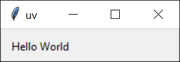

# 运行脚本

Python 脚本是一个用于独立执行的文件，例如使用 `python <script>.py`。使用 uv 来执行脚本可以确保脚本的依赖项得到管理，而无需手动管理环境。

!!! note

    如果你不熟悉 Python 环境：每个 Python 安装都有一个可以安装包的环境。通常，建议创建 [_虚拟环境_](https://docs.python.org/3/library/venv.html) 来隔离每个脚本所需的包。uv 会自动为你管理虚拟环境，并倾向于使用 [声明式](#declaring-script-dependencies) 方式来处理依赖。

## 运行没有依赖的脚本

如果你的脚本没有依赖项，可以使用 `uv run` 执行它：

```python title="example.py"
print("Hello world")
```

```console
$ uv run example.py
Hello world
```

<!-- TODO(zanieb): 一旦我们有了 `python` shim，注意你也可以在这里使用 `python` 执行 -->

同样，如果你的脚本依赖于标准库中的模块，也不需要做额外的操作：

```python title="example.py"
import os

print(os.path.expanduser("~"))
```

```console
$ uv run example.py
/Users/astral
```

你可以向脚本传递参数：

```python title="example.py"
import sys

print(" ".join(sys.argv[1:]))
```

```console
$ uv run example.py test
test

$ uv run example.py hello world!
hello world!
```

此外，你还可以直接从 stdin 读取脚本：

```console
$ echo 'print("hello world!")' | uv run -
```

或者，如果你的 shell 支持 [here-documents](https://en.wikipedia.org/wiki/Here_document)：

```bash
uv run - <<EOF
print("hello world!")
EOF
```

请注意，如果在 _项目_ 中使用 `uv run`，即在包含 `pyproject.toml` 的目录中，它将在运行脚本之前安装当前项目。如果你的脚本不依赖于该项目，可以使用 `--no-project` 标志跳过此步骤：

```console
$ # 注意，标志必须在脚本之前
$ uv run --no-project example.py
```

有关在项目中工作的更多细节，请参阅 [项目指南](./projects.md)。

## 运行有依赖的脚本

当你的脚本需要其他包时，这些包必须安装到脚本运行的环境中。uv 更倾向于按需创建这些环境，而不是使用一个长时间存在的虚拟环境来手动管理依赖项。这要求显式声明脚本所需的依赖项。通常，建议使用 [项目](./projects.md) 或 [内联元数据](#declaring-script-dependencies) 来声明依赖项，但 uv 也支持每次调用时请求依赖项。

例如，以下脚本需要 `rich` 库：

```python title="example.py"
import time
from rich.progress import track

for i in track(range(20), description="For example:"):
    time.sleep(0.05)
```

如果没有指定依赖项，执行该脚本将失败：

```console
$ uv run --no-project example.py
Traceback (most recent call last):
  File "/Users/astral/example.py", line 2, in <module>
    from rich.progress import track
ModuleNotFoundError: No module named 'rich'
```

可以使用 `--with` 选项请求依赖项：

```console
$ uv run --with rich example.py
For example: ━━━━━━━━━━━━━━━━━━━━━━━━━━━━━━━━━━━━━━━━ 100% 0:00:01
```

如果需要特定版本，可以对请求的依赖项添加版本限制：

```console
$ uv run --with 'rich>12,<13' example.py
```

可以通过重复使用 `--with` 选项来请求多个依赖项。

请注意，如果在 _项目_ 中使用 `uv run`，这些依赖项将被包含在项目的依赖项之外。要排除此行为，请使用 `--no-project` 标志。

## 创建 Python 脚本

Python 最近为 [内联脚本元数据](https://packaging.python.org/en/latest/specifications/inline-script-metadata/#inline-script-metadata) 添加了标准格式。它允许选择 Python 版本并定义依赖项。使用 `uv init --script` 来初始化带有内联元数据的脚本：

```console
$ uv init --script example.py --python 3.12
```

## 声明脚本依赖 {: #declaring-script-dependencies}

内联元数据格式允许在脚本本身中声明依赖项。

uv 支持为你添加和更新内联脚本元数据。使用 `uv add --script` 来声明脚本的依赖项：

```console
$ uv add --script example.py 'requests<3' 'rich'
```

这将会在脚本顶部添加一个 `script` 部分，使用 TOML 声明依赖项：

```python title="example.py"
# /// script
# dependencies = [
#   "requests<3",
#   "rich",
# ]
# ///

import requests
from rich.pretty import pprint

resp = requests.get("https://peps.python.org/api/peps.json")
data = resp.json()
pprint([(k, v["title"]) for k, v in data.items()][:10])
```

uv 会自动创建一个环境，并安装运行脚本所需的依赖项，例如：

```console
$ uv run example.py
[
│   ('1', 'PEP Purpose and Guidelines'),
│   ('2', 'Procedure for Adding New Modules'),
│   ('3', 'Guidelines for Handling Bug Reports'),
│   ('4', 'Deprecation of Standard Modules'),
│   ('5', 'Guidelines for Language Evolution'),
│   ('6', 'Bug Fix Releases'),
│   ('7', 'Style Guide for C Code'),
│   ('8', 'Style Guide for Python Code'),
│   ('9', 'Sample Plaintext PEP Template'),
│   ('10', 'Voting Guidelines')
]
```

!!! important

    当使用内联脚本元数据时，即使 `uv run` [在 _项目_ 中使用](../concepts/projects/run.md)，项目的依赖项也会被忽略。此时不需要使用 `--no-project` 标志。

uv 还会遵守 Python 版本要求：

```python title="example.py"
# /// script
# requires-python = ">=3.12"
# dependencies = []
# ///

# 使用 Python 3.12 添加的某些语法
type Point = tuple[float, float]
print(Point)
```

!!! note

    即使 `dependencies` 字段为空，也必须提供该字段。

`uv run` 将搜索并使用所需的 Python 版本。如果该版本未安装，Python 会被下载——有关更多详细信息，请参阅 [Python 版本](../concepts/python-versions.md) 文档。

## 提高可重复性

uv 支持在内联脚本元数据的 `tool.uv` 部分中使用 `exclude-newer` 字段，限制 uv 仅考虑在特定日期之前发布的分发版本。这对于提高脚本在稍后运行时的可重复性非常有用。

日期必须以 [RFC 3339](https://www.rfc-editor.org/rfc/rfc3339.html) 时间戳的形式指定（例如，`2006-12-02T02:07:43Z`）。

```python title="example.py"
# /// script
# dependencies = [
#   "requests",
# ]
# [tool.uv]
# exclude-newer = "2023-10-16T00:00:00Z"
# ///

import requests

print(requests.__version__)
```

## 使用不同的 Python 版本

uv 允许在每次脚本调用时请求任意 Python 版本，例如：

```python title="example.py"
import sys

print(".".join(map(str, sys.version_info[:3])))
```

```console
$ # 使用默认的 Python 版本，可能与你的机器不同
$ uv run example.py
3.12.6
```

```console
$ # 使用特定的 Python 版本
$ uv run --python 3.10 example.py
3.10.15
```

有关请求 Python 版本的更多详细信息，请参阅 [Python 版本请求](../concepts/python-versions.md#requesting-a-version) 文档。

## 使用 GUI 脚本

在 Windows 上，uv 会使用 `pythonw` 运行以 `.pyw` 扩展名结尾的脚本：

```python title="example.pyw"
from tkinter import Tk, ttk

root = Tk()
root.title("uv")
frm = ttk.Frame(root, padding=10)
frm.grid()
ttk.Label(frm, text="Hello World").grid(column=0, row=0)
root.mainloop()
```

```console
PS> uv run example.pyw
```

{: style="height:50px;width:150px"}

同样，它也适用于带有依赖项的脚本：

```python title="example_pyqt.pyw"
import sys
from PyQt5.QtWidgets import QApplication, QWidget, QLabel, QGridLayout

app = QApplication(sys.argv)
widget = QWidget()
grid = QGridLayout()

text_label = QLabel()
text_label.setText("Hello World!")
grid.addWidget(text_label)

widget.setLayout(grid)
widget.setGeometry(100, 100, 200, 50)
widget.setWindowTitle("uv")
widget.show()
sys.exit(app.exec_())
```

```console
PS> uv run --with PyQt5 example_pyqt.pyw
```

{: style="height:50px;width:150px"}

## 下一步

要了解更多关于 `uv run` 的信息，请参阅 [命令参考](../reference/cli.md#uv-run)。

或者，继续阅读以了解如何使用 uv [运行和安装工具](./tools.md)。
